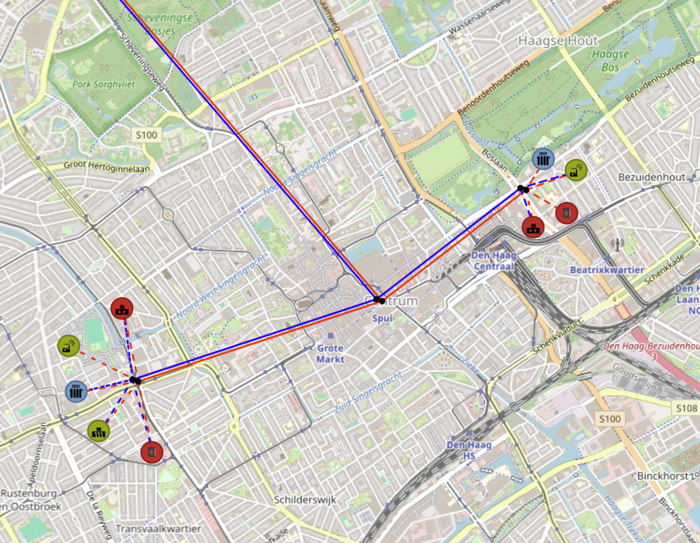

Asset Connection Scenarios
==========================

This section presents a collection of common asset connection scenarios. The examples illustrate how assets can be
connected to satisfy specific system requirements and operational constraints. These practical cases serve as a
reference to help users correctly configure their energy system models.

Connecting a Geothermal Source to Heat Network via a Heat Pump
--------------------------------------------------------------

When the available geothermal source temperature is lower than the required heat network supply temperature, the
geothermal source cannot be connected directly to the network. In this case, a heat pump is used to upgrade the
geothermal heat to the required temperature level. The heated output (i.e. secondary output) from the heat pump is
then supplied to the heat network, ensuring that the network temperature requirements are met.

Creating Heat Network Cluster
-----------------------------
asd

.. _image_cluster_example:

    Example of how the cluster can be created and connected to the heat network.

Connecting ATES and Heat Buffer to Heat Network
------------------------------------------------

asd
