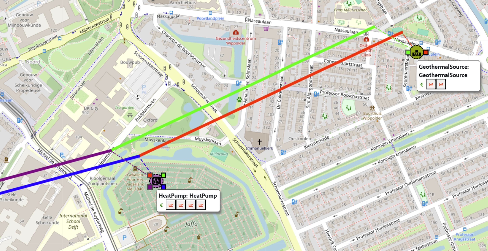
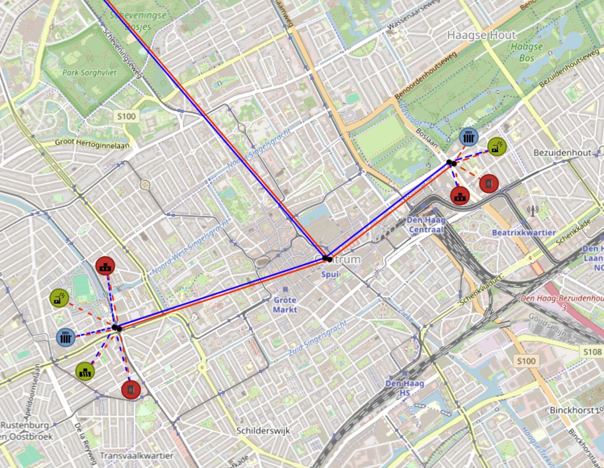
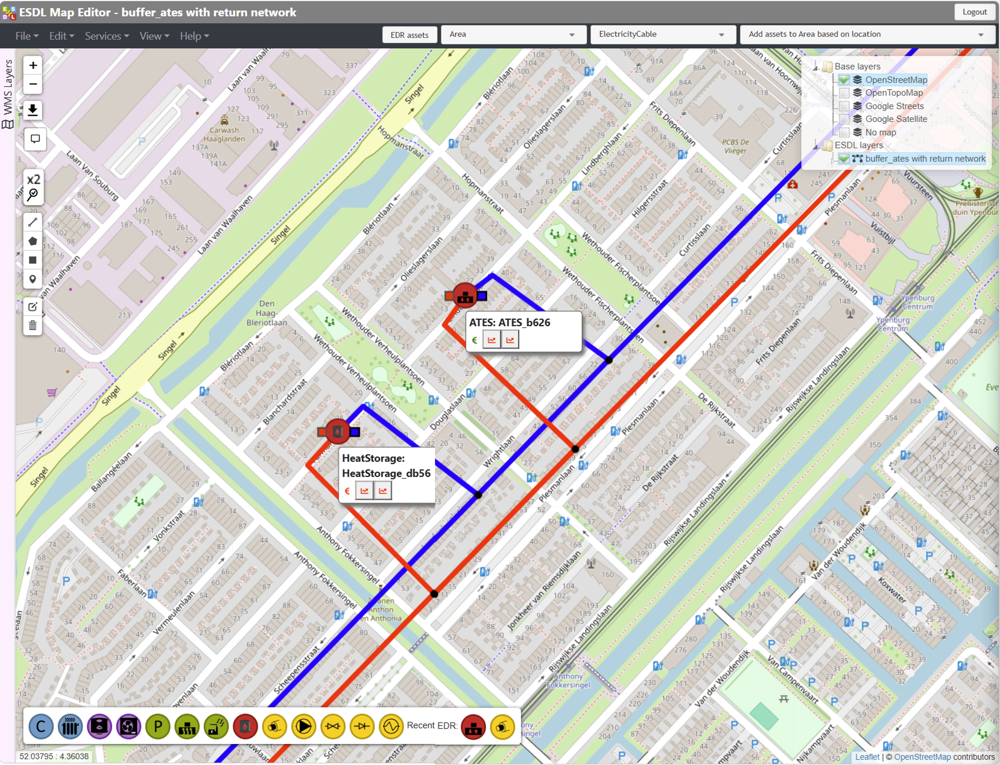

Common Asset Connection Scenarios
=================================

This section presents a collection of common asset connection scenarios. The examples illustrate how assets can be
connected to satisfy specific system requirements and operational constraints. These practical cases serve as a
reference to help users correctly configure their energy system models.

Connecting a Geothermal Source to Heat Network via a Heat Pump
--------------------------------------------------------------

When the available geothermal source temperature is lower than the required heat network supply temperature, the
geothermal source cannot be connected directly to the network. In this case, a heat pump is used to upgrade the
geothermal heat to the required temperature level. The heated output (i.e. secondary output) from the heat pump is
then supplied to the heat network, ensuring that the network temperature requirements are met.

.. _image_connecting_geo_to_heatpump:

    Example of how the geothermal source can be connected to the heatpump.

.. list-table:: Geothermal Source Water-to-water Heatpump Connection
   :widths: 2 2
   :header-rows: 1

   * - Item
     - Description
   * - Red port of heat pump
     - Primary inlet of heat pump
   * - Green port of heat pump
     - Primary outlet of heat pump
   * - Purple port of heat pump
     - Secondary inlet of heat pump
   * - Blue port of heat pump
     - Secondary outlet of heat pump
   * - Green port of geothermal source
     - Primary inlet of geothermal source
   * - Red pipe
     - Supply line of primary heat carrier
   * - Green pipe
     - Return line of primary heat carrier
   * - Blue pipe
     - Supply line of secondary heat carrier
   * - Purple pipe
     - Return line of secondary heat carrier

Creating Heat Network Cluster
-----------------------------
The user may want to create a large heat network, which consists of clusters of multiple assets such as: heat demand,
heat source, storage and conversion assets. If the user is not interested in pipe sizing within the clusters,
they can connect all the assets in the same cluster to a joint with a logical link rather than pipe connections.

The figure below illustrates a section of  heat network with 2 clusters with multiple assets connected to joints with logical links.
The joints are then connected to the main heat network via a pipe connection.

.. _image_cluster_example:

    Example of how the cluster can be created and connected to the heat network.

Connecting ATES and Heat Buffer to Heat Network
------------------------------------------------

.. _image_connect_buffer_ates:

    Example of how the heat storage and HT-ATES connected to the heat network.
