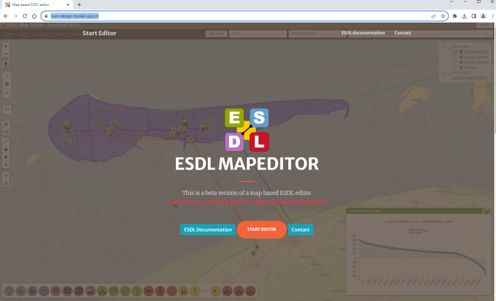
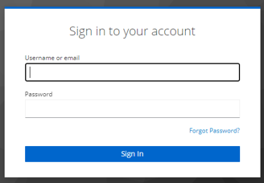
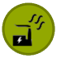
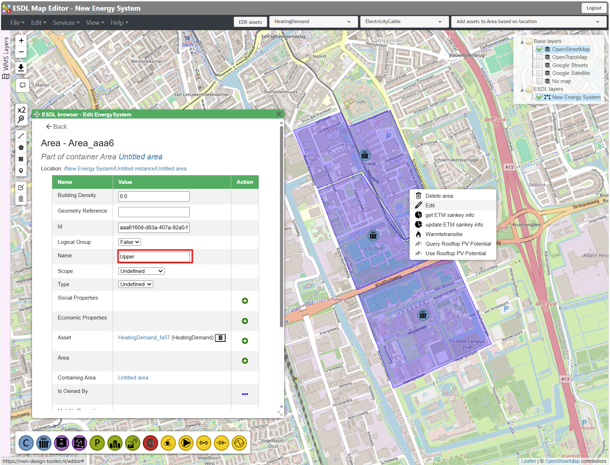
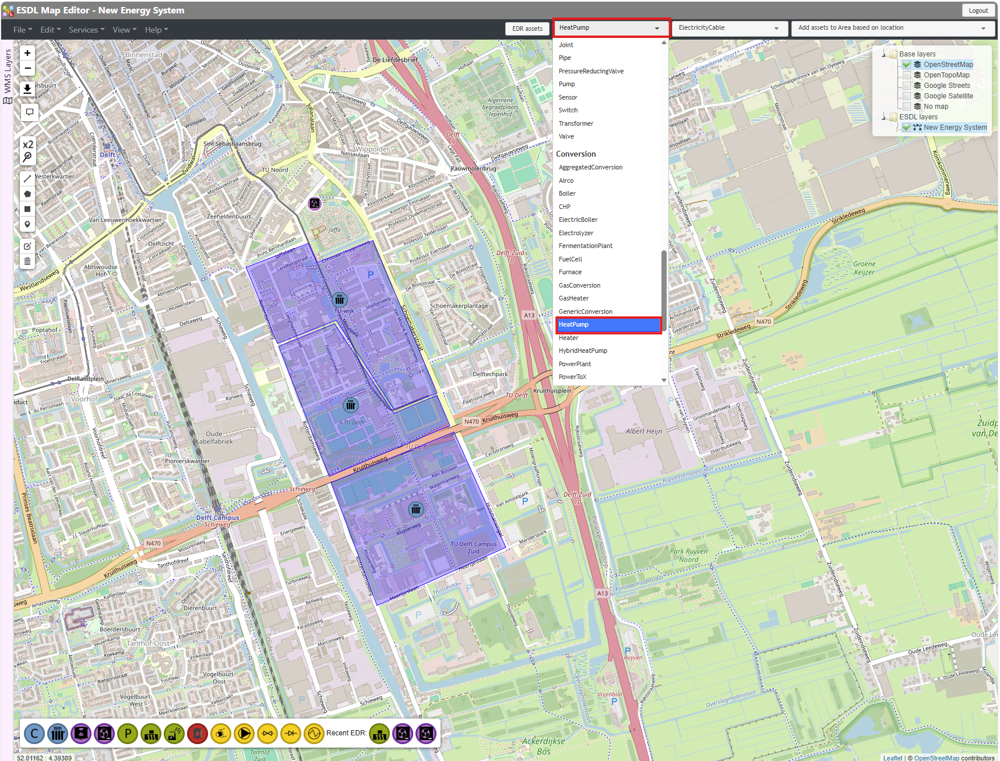
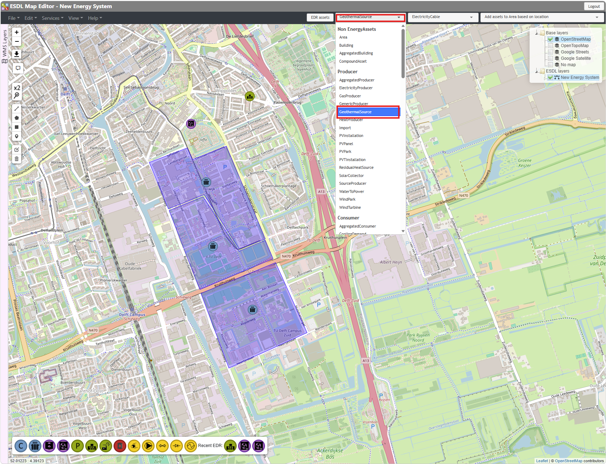

Getting Started with Design Toolkit
-----------------------------------

Start Environment
^^^^^^^^^^^^^^^^^

Open Chrome or Firefox (Edge and Internet Explorer are not supported)

Go to: https://nwn-design-toolkit.nl

Click red button: Start editor

.. _image_start_environment_1:

    Design Toolkit start page.

Sign in with email and your password

.. _image_start_environment_2:

    Sign in to account.

If it is the first time you use this environment:

 Click: Forgot Password?

 Fill in email address and wait for the email to set your password

 If it takes more than a minute check your junk folder

ESDL MapEditor
^^^^^^^^^^^^^^
Once you log in into the Design Toolkit, you will see ESDL MapEditor user interface as shown in the following picture:

.. _esdl_mapeditor:
.. figure:: images_example_cases/esdl_mapeditor.png
    :figwidth: 5in
    :align: center

    Design Toolkit user interface.

.. list-table:: DTK User Interface
   :widths: 2 20
   :header-rows: 1

   * - Number
     - Description
   * - 1
     - Controls visibility of different layers on the map: both the background and different loaded ESDLs
   * - 2
     - Quickly add a specific asset to the map
   * - 3
     - Move assets and delete assets
   * - 4
     - Draw an asset on the map represented as a line, a polygon, a square or a point
   * - 5
     - Use ESDL Dual pipe service and Validator
   * - 6
     - Select asset type to add to the map

DTK Supported Assets
^^^^^^^^^^^^^^^^^^^^

.. list-table:: DTK Supported Asset Icons
   :widths: 2 1 20
   :header-rows: 1

   * - ESDL Asset Types
     - Example Icons
     - ESDL Asset Class
   * - Producer
     - |icon_geothermal_source| |icon_residual_heat_source|
     - GeothermalSource, ResidualHeatSource, HeatProducer
   * - Consumer
     - |icon_heating_demand|
     - HeatingDemand
   * - Conversion
     - |icon_heat_pump| |icon_gas_heater| |icon_electric_boiler|
     - HeatPump, GasHeater, ElectricBoiler
   * - Storage
     - |icon_heat_storage| |icon_ates|
     - HeatStorage, HT-ATES
   * - Transport
     - |icon_heat_exchange| |icon_pipe|
     - HeatExchange, Pipe

A Simple Network
^^^^^^^^^^^^^^^^

Place Demand Areas
^^^^^^^^^^^^^^^^^^

Draw a polygon area that reflects the demand area.

 Place a heating demand in the polygon.

 Right-click on the area and click ``Edit``.

 Rename it to ``Upper``.

 Refresh the browser.

 Hover over the area to check the name.

Draw 2 more areas named ``Middle`` and ``Lower``.

.. _place_demand_areas:

    Demand area placement.

Place Heat Pump
^^^^^^^^^^^^^^^

Select the heat pump EDR* Asset

Place the asset on the north of Demand_1

Name the asset as “HeatPump”

.. _place_heatpump:

    Heat pump placement.

Place Geothermal Source
^^^^^^^^^^^^^^^^^^^^^^^
Select the heat pump EDR Asset

Place the asset next to Heat Pump

Name the asset as “GeothermalSource”

.. _place_geothermal_source:

    Geothermal source placement.

Connect Pipes
^^^^^^^^^^^^^^

Define Energy Carriers
^^^^^^^^^^^^^^^^^^^^^^

Assigning Carriers
^^^^^^^^^^^^^^^^^^

Configure Heating Demand Attributes
^^^^^^^^^^^^^^^^^^^^^^^^^^^^^^^^^^^

Configure Heating Demands Profiles
^^^^^^^^^^^^^^^^^^^^^^^^^^^^^^^^^^

Configure Heat Pump Asset
^^^^^^^^^^^^^^^^^^^^^^^^^

Configure Geothermal Source
^^^^^^^^^^^^^^^^^^^^^^^^^^^

Complete the Network Connections
^^^^^^^^^^^^^^^^^^^^^^^^^^^^^^^^

Case Optimization
^^^^^^^^^^^^^^^^^

Load the Results
^^^^^^^^^^^^^^^^

Results – KPI Dashboard
^^^^^^^^^^^^^^^^^^^^^^^

Results – ESDL Analytics
^^^^^^^^^^^^^^^^^^^^^^^^
