Getting Started with Design Toolkit
-----------------------------------

Start Environment
^^^^^^^^^^^^^^^^^

Open Chrome or Firefox (Edge and Internet Explorer are not supported)

Go to: https://nwn-design-toolkit.nl

Click red button: Start editor

.. _image_start_environment_1:
.. figure:: images_example_cases/start_environment_1.png
    :figwidth: 5in
    :align: center

    Design Toolkit start page.

Sign in with email and your password

.. _image_start_environment_2:
.. figure:: images_example_cases/start_environment_2.png
    :figwidth: 3in
    :align: center

    Sign in to account.

If it is the first time you use this environment:

 Click: Forgot Password?

 Fill in email address and wait for the email to set your password

 If it takes more than a minute check your junk folder

ESDL MapEditor
^^^^^^^^^^^^^^
Once you log in into the Design Toolkit, you will see ESDL MapEditor user interface as shown in the following picture:

.. _esdl_mapeditor:
.. figure:: images_example_cases/esdl_mapeditor.png
    :figwidth: 5in
    :align: center

    Design Toolkit user interface.

.. list-table:: DTK User Interface
   :widths: 2 20
   :header-rows: 1

   * - Number
     - Description
   * - 1
     - Controls visibility of different layers on the map: both the background and different loaded ESDLs
   * - 2
     - Quickly add a specific asset to the map
   * - 3
     - Move assets and delete assets
   * - 4
     - Draw an asset on the map represented as a line, a polygon, a square or a point
   * - 5
     - Use ESDL Dual pipe service and Validator
   * - 6
     - Select asset type to add to the map
   * - 7
     - Asset draw select tool

DTK Supported Assets
^^^^^^^^^^^^^^^^^^^^

.. |icon_geothermal_source| image:: images_example_cases/asset_icon_GeothermalSource.png
   :width: 24px

.. |icon_residual_heat_source| image:: images_example_cases/asset_icon_ResidualHeatSource.png
   :width: 24px

.. |icon_heating_demand| image:: images_example_cases/asset_icon_HeatingDemand.png
   :width: 24px

.. |icon_heat_pump| image:: images_example_cases/asset_icon_HeatPump.png
   :width: 24px

.. |icon_gas_heater| image:: images_example_cases/asset_icon_GasHeater.png
   :width: 24px

.. |icon_electric_boiler| image:: images_example_cases/asset_icon_ElectricBoiler.png
   :width: 24px

.. |icon_heat_storage| image:: images_example_cases/asset_icon_HeatStorage.png
   :width: 24px

.. |icon_ates| image:: images_example_cases/asset_icon_HT-ATES.png
   :width: 24px

.. |icon_heat_exchange| image:: images_example_cases/asset_icon_HeatExchange.png
   :width: 24px

.. |icon_pipe| image:: images_example_cases/asset_icon_Pipe.png
   :width: 24px

.. list-table:: DTK Supported Asset Icons
   :widths: 2 1 20
   :header-rows: 1

   * - ESDL Asset Types
     - Example Icons
     - ESDL Asset Class
   * - Producer
     - |icon_geothermal_source| |icon_residual_heat_source|
     - GeothermalSource, ResidualHeatSource, HeatProducer
   * - Consumer
     - |icon_heating_demand|
     - HeatingDemand
   * - Conversion
     - |icon_heat_pump| |icon_gas_heater| |icon_electric_boiler|
     - HeatPump, GasHeater, ElectricBoiler
   * - Storage
     - |icon_heat_storage| |icon_ates|
     - HeatStorage, HT-ATES
   * - Transport
     - |icon_heat_exchange| |icon_pipe|
     - HeatExchange, Pipe

A Simple Network
^^^^^^^^^^^^^^^^

Place Demand Areas
^^^^^^^^^^^^^^^^^^

Draw a polygon area that reflects the demand area.

 Place a heating demand in the polygon.

 Right-click on the area and click ``Edit``.

 Rename it to ``Upper``.

 Refresh the browser.

 Hover over the area to check the name.

Draw 2 more areas named as “Middle” and “Lower” and 1 Heating Demand asset into each areas

Rename the Heating Demands as Demand_1, Demand_2 and Demand_3.

.. _place_demand_areas:
.. figure:: images_example_cases/place_demand_areas.png
    :figwidth: 5in
    :align: center

    Demand area placement.

Place Heat Pump
^^^^^^^^^^^^^^^

Select the heat pump from asset draw select tool

Place the asset on the north of Demand_1

Name the asset as “HeatPump”

.. _place_heatpump:
.. figure:: images_example_cases/place_heatpump.png
    :figwidth: 5in
    :align: center

    Heat pump placement.

Place Geothermal Source
^^^^^^^^^^^^^^^^^^^^^^^
Select the heat pump from asset draw select tool

Place the asset next to Heat Pump

Name the asset as “GeothermalSource”

.. _place_geothermal_source:
.. figure:: images_example_cases/place_geothermal_source.png
    :figwidth: 5in
    :align: center

    Geothermal source placement.

Connect Pipes
^^^^^^^^^^^^^^
Select EDR assets:

    Select “Pipe” asset

    Select specific DN size (Steel-s1-DN-400).

        Note: In the case of pipe sizing optimization, selected pipe size will be the upper limit of the pipe diameter sets.

Start drawing pipeline:

    Click on “OutPort” of GeothermalSource

    Create route by intermediate clicks

    End by clicking on “PrimIn” port of HeatPump

    Click on “SecOut” port of HeatPump

    Create route by intermediate clicks

    End by clicking on “In” port of Demand_3

Click select

.. _connect_pipes_1:
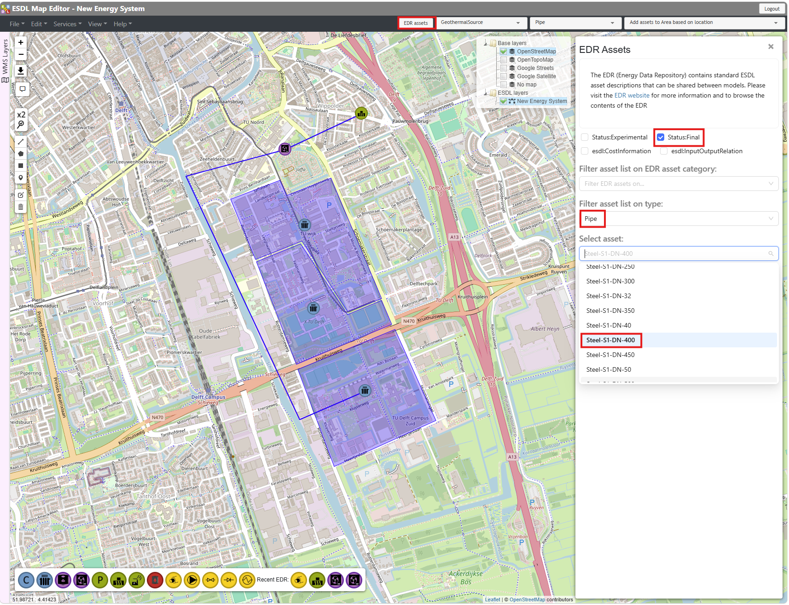

    Pipe connection between Geothermal Source, Heat Pump and Heat Demand.

Right click pipe at location of foreseen :

    Split and add

    Always use  to connect multiple pipes

Draw pipe from “OutPort” of  to “InPort” of Demand_1

Apply the same method to connect Demand_2

.. list-table:: Connect pipes example
   :widths: 33 33 33
   :align: center

   * - .. figure:: images_example_cases/connect_pipes_2.png
          :width: 100%
     - .. figure:: images_example_cases/connect_pipes_3.png
          :width: 100%
     - .. figure:: images_example_cases/connect_pipes_4.png
          :width: 100%

Define Energy Carriers
^^^^^^^^^^^^^^^^^^^^^^

Select ‘Energy carriers…’ from the Edit menu

Select ‘HeatCommodity’ as a Carrier type

Define name and supply/return temperatures

Click on “Add”

.. _define_energy_carriers_1:
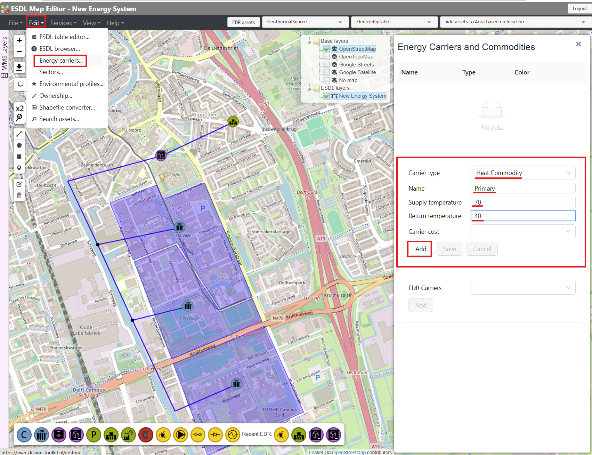

    Define primary side energy carriers.

.. _define_energy_carriers_2:
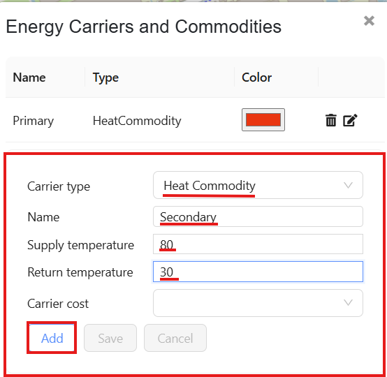

    Define secondary side energy carriers.

As you add, the list of carrier appears.

.. _define_energy_carriers_3:
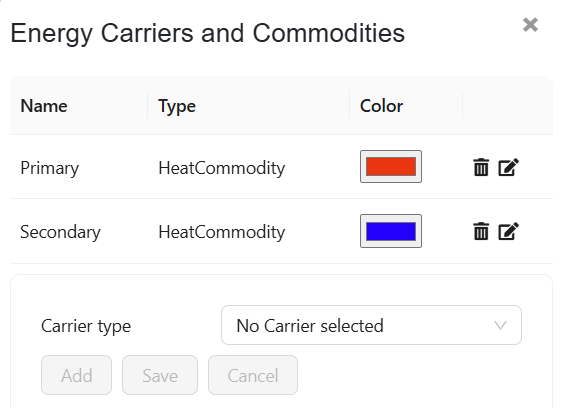

Assigning Carriers
^^^^^^^^^^^^^^^^^^
Right click on pipe between Geothermal Source and HeatPump:

    Set carrier

    Select “Primary” carrier

Right click on pipe between Geothermal Source and Demands:

    Set carrier

    Select “Secondary” carrier

.. _assigning_carriers_1:
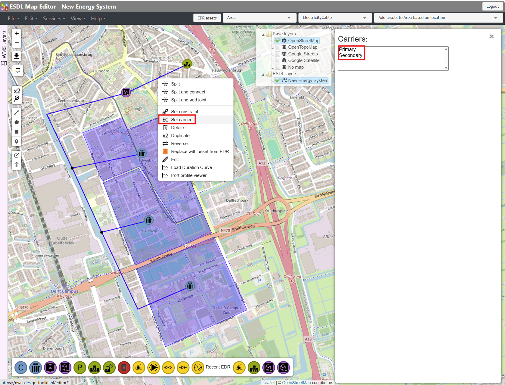

    Assign Primary and Secondary pipes to the regarding pipes.

After carrier assignment, the pipe color will change to reflect the carrier type.

.. _assigning_carriers_2:
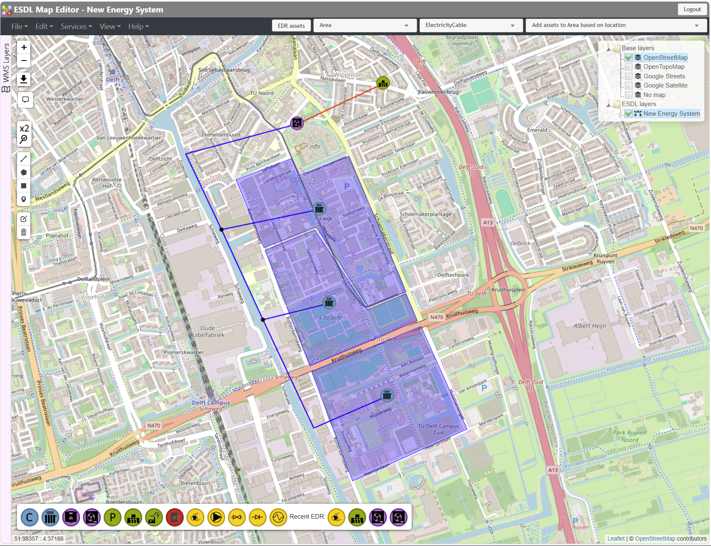

    Pipes with assigned carrier.

Configure Heating Demand Attributes
^^^^^^^^^^^^^^^^^^^^^^^^^^^^^^^^^^^

Left click on the Heating Demand in the north.

From the pop-up window change the name to Demand_1

Assign 2 MW as the capacity from the power attribute

Add the required cost information

Refresh the page to see the name change is applied

.. configure_heating_demand:
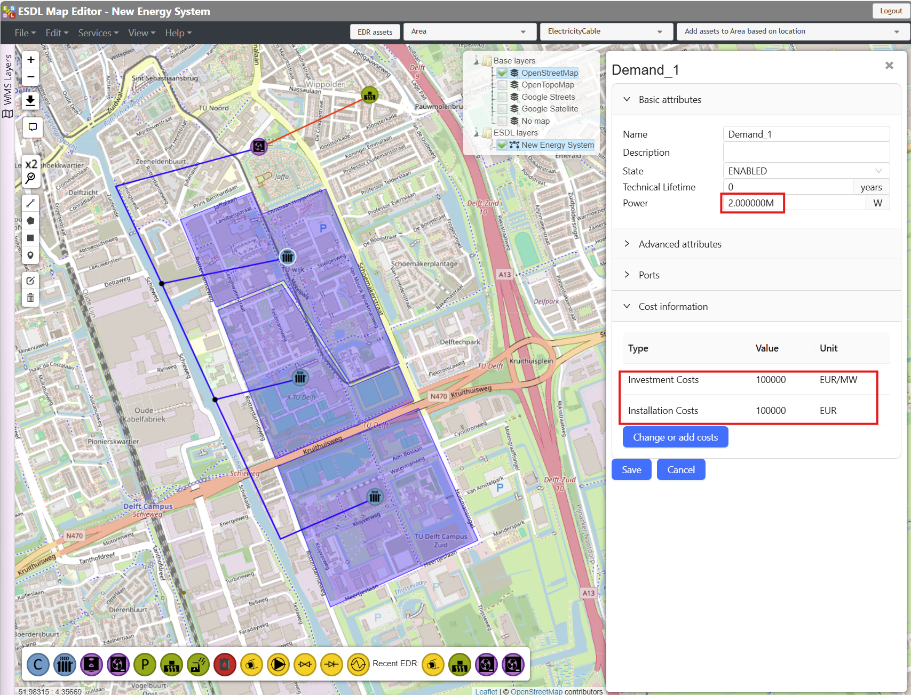

    Demand_1 configurations.

Do the updates on the Power capacities also on other two heating demands as indicated in the below table.
Use the same cost information as Demand_1

.. list-table:: Heating Demand Power Attributes
   :widths: 2 2
   :header-rows: 1

   * - Asset Name
     - Power [MW]
   * - Demand_1
     - 2
   * - Demand_2
     - 3
   * - Demand_3
     - 2

Configure Heating Demands Profiles
^^^^^^^^^^^^^^^^^^^^^^^^^^^^^^^^^^

Right click on the Demand_1.

From the pop-up window slick on “Set profile of InPort: in”

Enter the displayed values in the profile attributes

.. configure_heating_demand_profile:
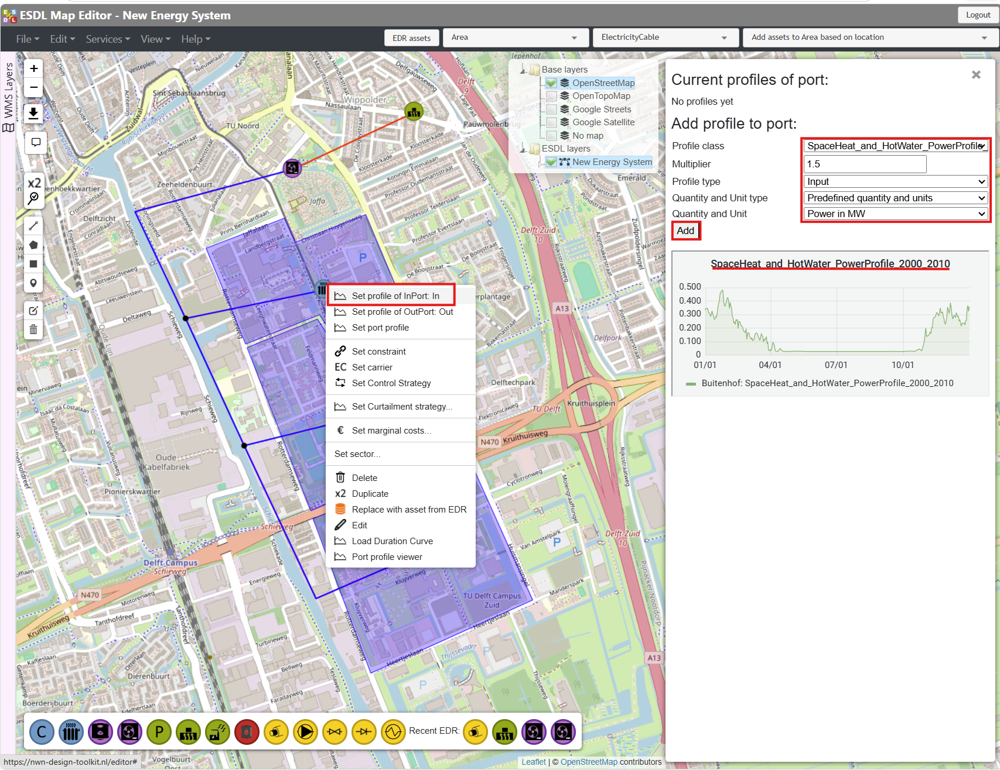

    Demand_1 profile configurations.

Do the updates on other two heating demands as indicated in the below table

.. list-table:: Heating Demand Profiles
   :widths: 2 2 2 5
   :header-rows: 1

   * - Asset Name
     - Multiplier
     - Unit
     - Profile Name
   * - Demand_1
     - 1.5
     - MW
     - SpaceHeat_and_HotWater_PowerProfile_2000_2010
   * - Demand_2
     - 2
     - MW
     - SpaceHeat_and_HotWater_PowerProfile_2000_2010
   * - Demand_3
     - 1.5
     - MW
     - SpaceHeat_and_HotWater_PowerProfile_2000_2010

Configure Heat Pump Asset
^^^^^^^^^^^^^^^^^^^^^^^^^

.. configure_heat_pump_1:
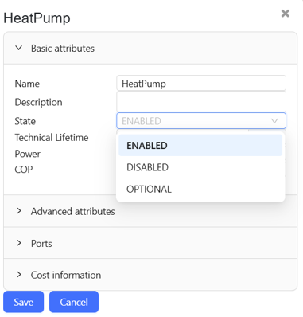

    State attribute configuration.

All assets can have two states:

.. list-table:: Possible asset states
   :widths: 2 1 20
   :header-rows: 1

   * - State
     - Asset Icon
     - Description
   * - Enabled (default)
     - |asset_icon_heatpump_enabled_source|
     - Asset will be placed and not sized
   * - Optional
     - |asset_icon_heatpump_enabled_demand|
     - Asset will be sized by optimization

Note that "Disabled" state is not supported by DTK.

Click on HeatPump asset

Configure the asset attributes on the pop-up window as displayed on the figure

    Power : 50 MW

    COP: 4

Set the State “Optional” from Basic Attributes

Cost attributes are configured from “Change or add costs” button

.. configure_heat_pump_2:
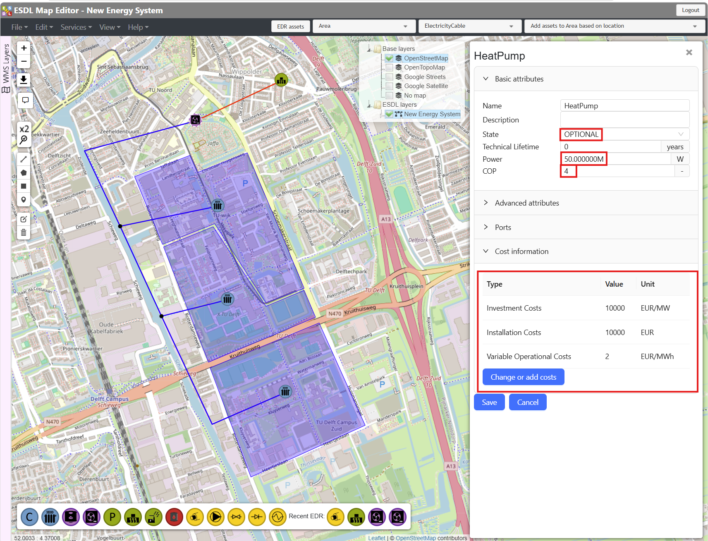

    Heat Pump configuration.

Configure Geothermal Source
^^^^^^^^^^^^^^^^^^^^^^^^^^^

Click on GeothermalSource asset

Configure the asset attributes on the pop-up window as displayed on the figure

    Power : 12 MW

    Set the State “Optional” from Basic Attributes

Cost attributes are configured from “Change or add costs” button

.. configure_geothermal_source:
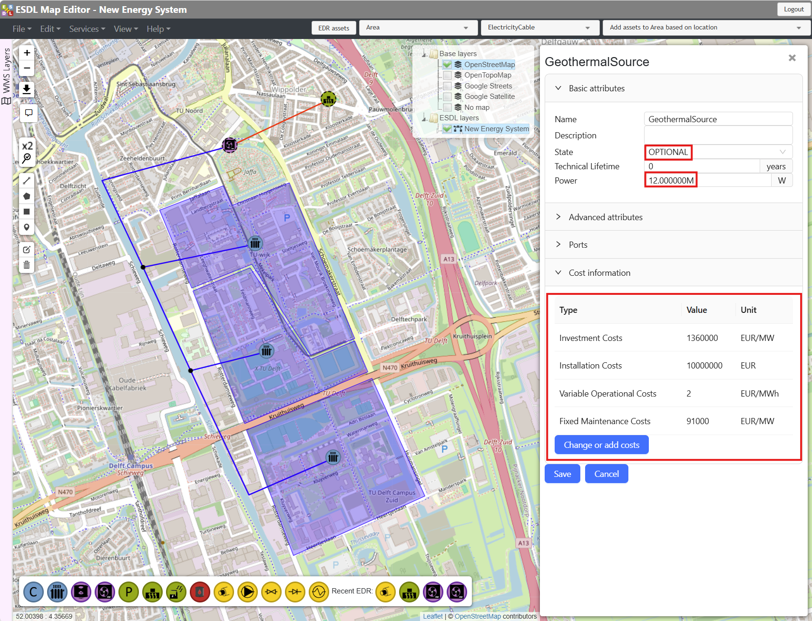

    Geothermal Source configuration.

Complete the Network Connections
^^^^^^^^^^^^^^^^^^^^^^^^^^^^^^^^
Rename the layer as “District_supply_only” and save

Use “ESDL Dual Pipe Services”

.. complete_network_connections_1:
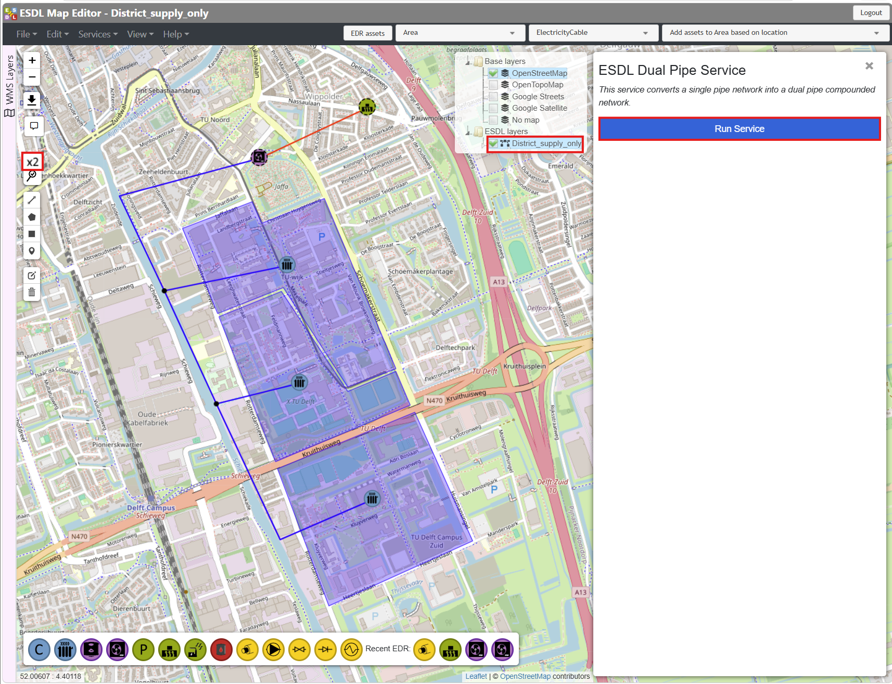

    Complete network only with supply pipes.

Use “ESDL Validator”  “Optimizer validation schema”

Rename the new layer as “District” and save it

You can remove all other layers except “District”

.. complete_network_connections_2:
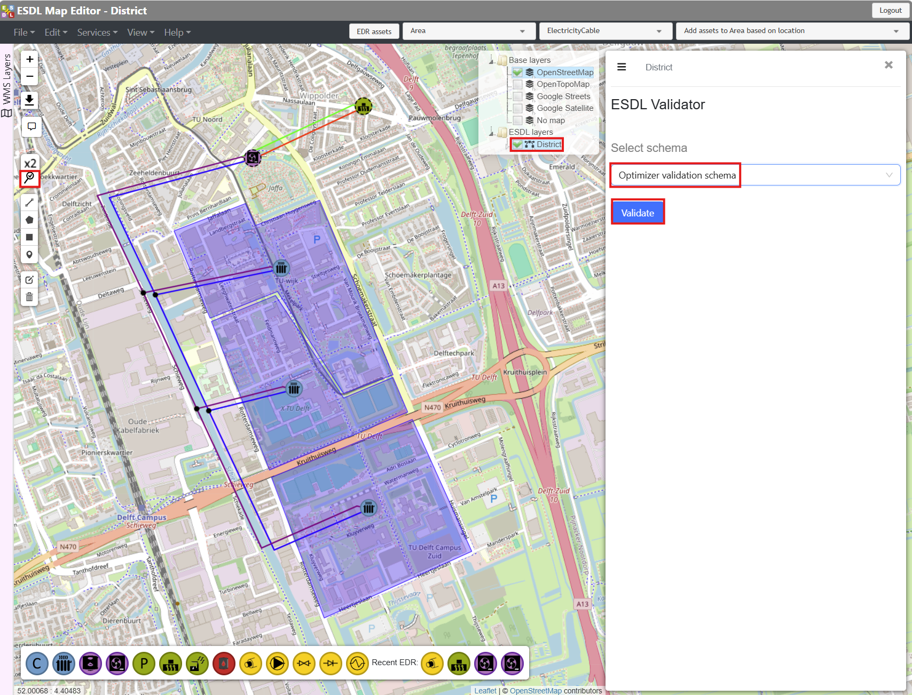

    Complete network.

Case Optimization
^^^^^^^^^^^^^^^^^
To start the optimization:

    From “Services” tab, go to
	    “External ESDL Services..”  Omotes

    Name the optimization as “District_opt”

    Select “Draft Design - Optimization”

    Run

.. optimize_1:
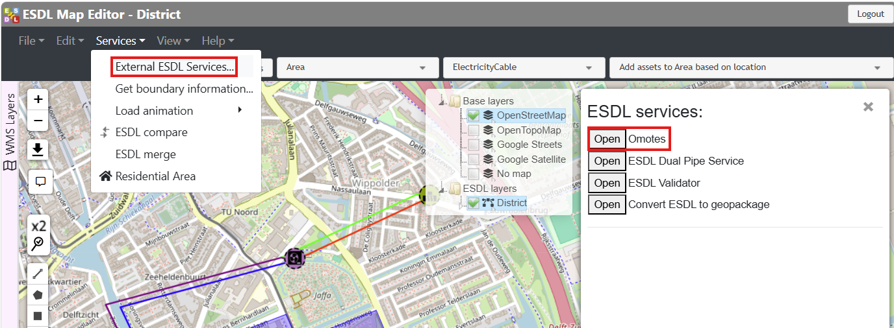

    Run the optimization.

.. optimize_2:
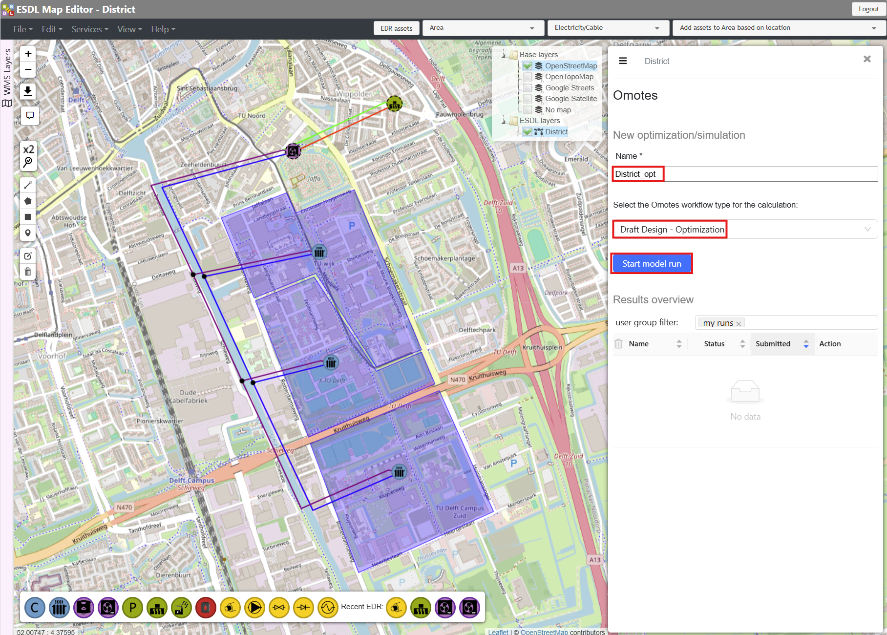

    Run the optimization.

Load the Results
^^^^^^^^^^^^^^^^

.. load_results:
.. figure:: images_example_cases/load_results.png
    :figwidth: 5in
    :align: center

    Load the results.

.. list-table:: Leading the results from the optimization
   :widths: 2 2
   :header-rows: 1

   * - Number
     - Description
   * - 1
     - Simulation is SUCCEEDED. Remove “District” layer. Load the “District_opt”
   * - 2
     - Area legend shows the variables related to demand areas
   * - 3
     - Shows the KPI Dashboard
   * - 4
     - Actions

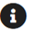

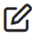

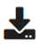

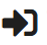

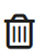

.. list-table:: Actions on the optimized esdl
   :widths: 2 20
   :header-rows: 1

   * - Icon
     - Description
   * - |load_results_icons_1_source|
     - Load result ESDL (i.e. Stad_opt)
   * - |load_results_icons_2_source|
     - View Omotes run details (i.e. logger output, warning, error…)
   * - |load_results_icons_3_source|
     - Edit Omotes run
   * - |load_results_icons_4_source|
     - Download  power, velocity and flow rate profiles of the assets as a .xlsx file
   * - |load_results_icons_5_source|
     - Load input ESDL (i.e. Stad)
   * - |load_results_icons_6_source|
     - Delete the result from data base

Results – KPI Dashboard
^^^^^^^^^^^^^^^^^^^^^^^

Results – ESDL Analytics
^^^^^^^^^^^^^^^^^^^^^^^^
