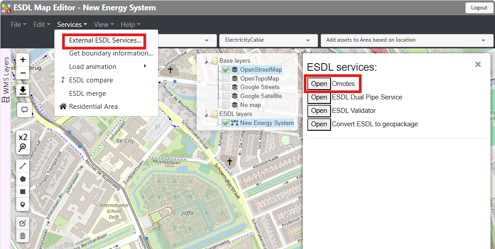
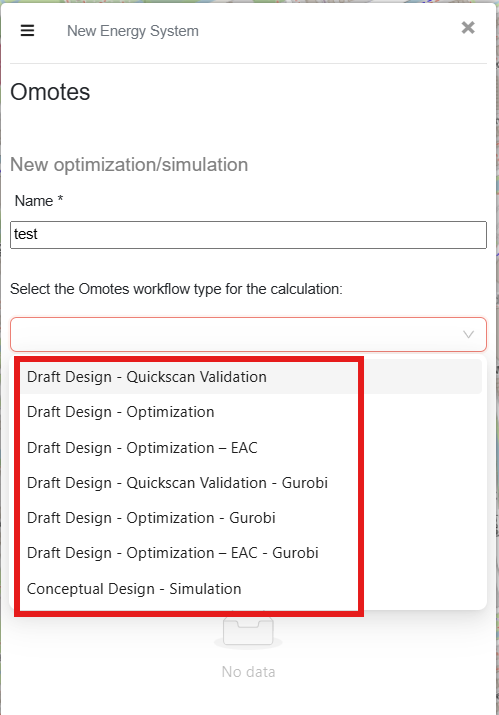

Workflows
=========

This page eleborates on the available Design Toolkit workflows...

To run an Omotes workflow over the ESDL, just click on "External ESDL Services..." from "Services" and select "Omotes" to open.

.. _image_omotes_workflow_access:

    Accessing to the Omotes workflows.

Then give a name to the run and select the desired workflow from the list of available workflows and click "Start model run" to start the workflow.

.. _image_omotes_workflows:

    Omotes workflows.

.. _draft_design_quickscan_validation-section:
Draft Design - Quickscan Validation
-----------------------------------

"Draft Design - Quickscan Validation" workflow is designed to optimize the ESDL of a heating network excluding the heat losses in
the network. This allows for a much faster optimization than other optimization workflows. It is suggested to be used
in the initial design phase of the large networks for fast iterations. This workflow uses `HiGHS <https://highs.dev//>`_
as the optimization solver.

Additional details on the cost workflow are discussed in the :ref:`end_scenario_sizing_no_heat_loss-section` section.

.. _draft_design_optimization-section:
Draft Design - Optimization
-----------------------------------

"Draft Design - Optimization" workflow is designed to optimize the ESDL of a heating network. The optimization objective function
includes the total CAPEX and OPEX of all enabled assets, as well as the OPEX of optional assets. This workflow uses
`HiGHS <https://highs.dev//>`_ as the optimization solver.

Additional details on the cost calculations and workflow are discussed in the :ref:`regular-cost-section` and
:ref:`end_scenario_sizing-section` sections, respectively.

.. _draft_design_optimization_eac-section:
Draft Design - Optimization - EAC
-----------------------------------

"Draft Design - Optimization - EAC"  workflow is designed to optimize the ESDL of a heating network. The optimization objective function
includes the Equivalent Annual Cost (EAC) of CAPEX and OPEX of all enabled assets, as well as EAC of the OPEX of optional
assets. This workflow uses `HiGHS <https://highs.dev//>`_ as the optimization solver.

Additional details on the annualized cost calculations and workflow are discussed in the :ref:`discounted-cost-section`
and :ref:`end_scenario_sizing_discounted-section` sections, respectively.

Draft Design - Quickscan Validation - Gurobi
--------------------------------------------

"Draft Design - Quickscan Validation - Gurobi" workflow is designed to optimize the ESDL of a heating network. Problem formulation
and the objective function are the same as in the :ref:`draft_design_quickscan_validation-section` workflow. The difference is that
this workflow uses `Gurobi Optimizer <https://www.gurobi.com/>`_ as the optimization solver instead of the default solver.

Draft Design - Optimization - EAC - Gurobi
--------------------------------------------------

"Draft Design - Optimization - EAC - Gurobi" workflow is designed to optimize the ESDL of a heating network. Problem formulation
and the objective function are the same as in the :ref:`draft_design_optimization_eac-section` workflow. The difference is that
this workflow uses `Gurobi Optimizer <https://www.gurobi.com/>`_ as the optimization solver instead of the default solver.

Conceptual Design - Simulation
------------------------------

"Conceptual Design - Simulation" workflow is designed to simulate the operation of a heating network over a user defined
time period with a user defined timestep. The simulation is based on the assets and their properties as defined in the ESDL.
All the assets in the input ESDL must be ENABLED. Resulting ESDLs of the optimization workflows can be used as an input
ESDL in this workflow. The simulation will return the time series of all the relevant outputs, such as thermal power,
flow rates, temperatures, etc. for all the assets in the system.